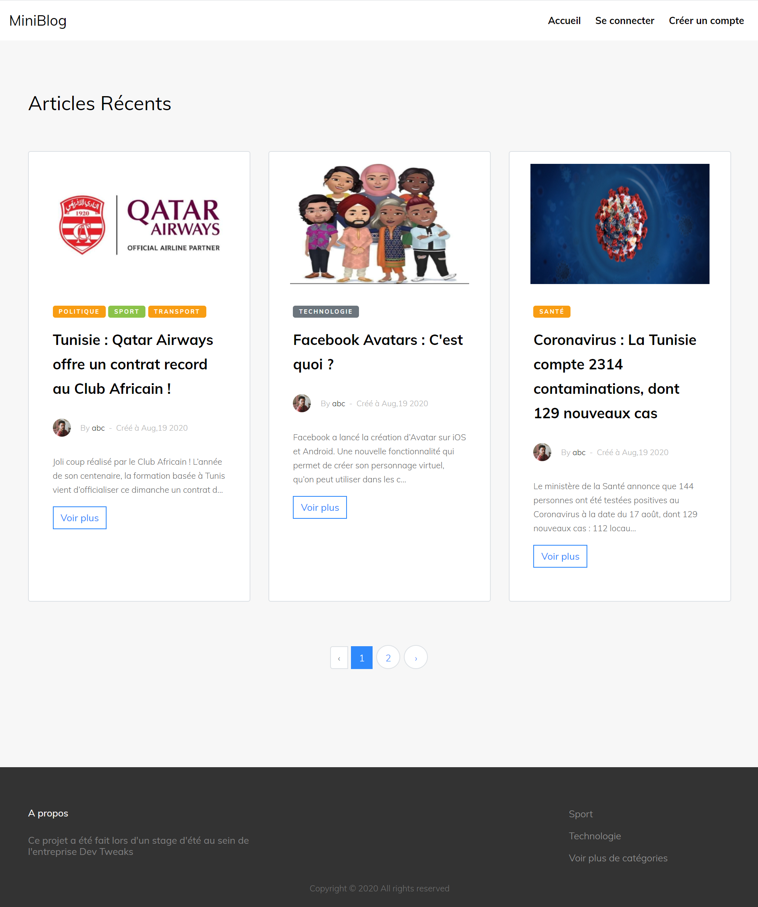

## About
This project was made during a summer internship within [Dev Tweaks](https://www.devtweaks.com/) development agency , using Laravel 5.6 and Crudbooster 5.4.

## How to run the project :
- Download or clone project
- Go to the folder application using cd
- Run composer install
- Run copy .env.example .env and change the database name
- Upload the database in phpmyadmin from public/database/blog.sql
- Run php artisan key:generate
- Run php artisan serve 

## These are some screenshots of the project:

## Small devices vue :

